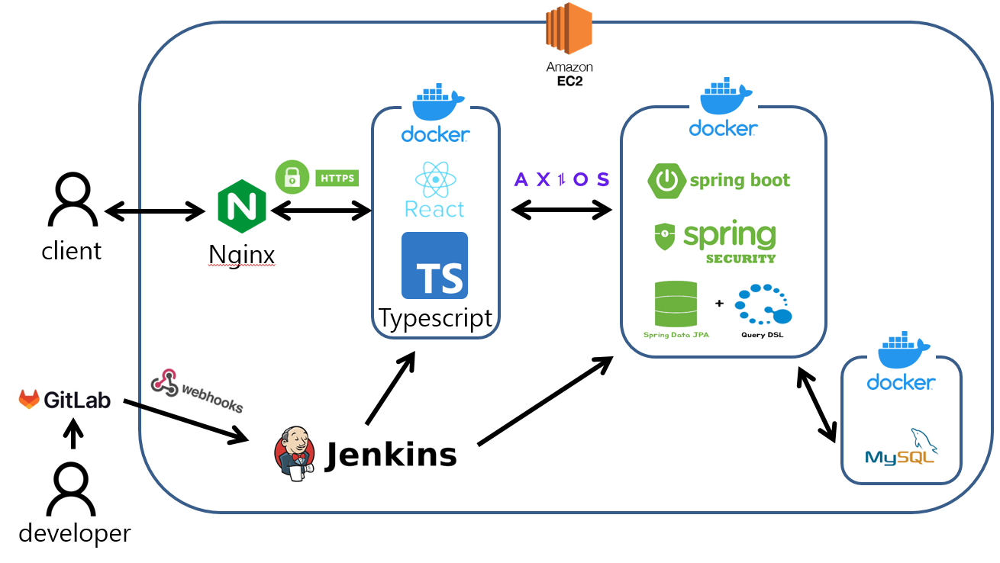

# 🎬 미리뷰
### 🎡 [미리 보는 리뷰, 내 맘대로 쓰는 리뷰, 미리뷰](./mereview-docs/file/홍보용%20UCC.mp4) 🎡


<br/>

## ⌛️ 프로젝트 진행 기간
### 2023-07-04 ~ 2023-08-18 (7주)


<br/>

## 👪팀원 소개
멋쟁이 팀원들을 소개할게요. 😊

### 🧑 김웅서
- FrontEnd
- GitHub : [ungseo](https://github.com/ungseo)
### 👦 민정인
- FrontEnd
- GitHub : [chati97](https://github.com/chati97)
### 👨 양진형
- FrontEnd
- GitHub : [yangJin-H](https://github.com/yangJin-H)
### 🧒 유승민
- 팀장, BackEnd
- GitHub : [byuri1356](https://github.com/byuri1356)
### 👨‍🦱 이정현
- BackEnd
- GitHub : [duljji](https://github.com/duljji)
### 🤠 최영환
- BackEnd
- GitHub : [longBright](https://github.com/longBright)
<!-- ### 📑 [팀 노션](https://spark-band-571.notion.site/41934e8ca4b447dda013fbf903684423?pvs=4) -->

<br/>


## 📚 기획 배경
### 📖 [프로젝트 기획](./mereview-docs/ProjectPlan.md)


<br/>

## 🔎 서비스 주요 기능
### 1) 리뷰 평가
  - 리뷰 평가를 통해 리뷰의 신뢰성을 확인할 수 있습니다.
### 2) 장르별 티어, 업적을 통한 재미 요소
  - 리뷰 작성후 받은 평가를 통해 티어 경험치를 얻을 수 있습니다.
  - 리뷰, 댓글 작성시 업적을 획득 할 수 있습니다.
### 3) 직관적이고 특색있는 리뷰 화면
  - 키워드, 한줄평, 사진 등을 통해 직관적이고 특색있는 리뷰를 볼 수 있습니다.
### 4) 관심 장르 리뷰 작성 알림
  - 관심 장르를 지정하고 리뷰 알림을 받아볼 수 있습니다.


<br/>

## 🔎 서비스 주요 기술
### 1) TMDB API
  - 영화 데이터를 저장하는데 사용
### 2) Quill
  - text additor 로 사용
### 3) Word Cloud
  - 리뷰 키워드를 word cloud로 보여줌
### 4) Material-UI
  - 디자인 활용
### 5) CQRS PATTERN
  - 읽기와 갱신 작업을 분리
  - 1단계 적용
  - Model Layer 부분만 Command 와 Query 로 분리 


<br/>

## 🧩 협업 도구
### GitLab
### Notion
### Figma
### JIRA
### MatterMost

<br/>

## 📺 서비스 화면
### [기능설명](./mereview-docs/file/기능설명%20UCC.mp4)

<!-- ### 회원가입 & 로그인

### 홈

### 영화 상세정보

### 리뷰 상세정보

### 회원 정보 -->

<br/>

## 📂 시스템 아키텍처



<br/>

## 📁 ERD


<br>

## 💕 후기
### 🧑 김웅서
```
새로운 사람들과 첫 공동 프로젝트를 진행함에 있어 부족함이 많았지만, 
백과 프론트, 프론트 팀원끼리의 의사소통 역량을 키우고, 
이를 바탕으로 프로젝트 마지막까지 좋은 분위기와 팀워크를 유지하며 즐겁게 마무리 할 수 있었습니다.

깃랩, 지라, 피그마등 여러 협업툴을 사용하며 프로젝트가 어떤식으로 시작해서 어떤식으로 끝맺음 되는지 전 과정을 이해하는데 도움이 되었고, 
실제 서비스를 출시한다는 마음가짐으로 마지막에 마지막까지 오류를 수정하고 시연하는 과정을 통해, 
하나의 서비스가 완성되는 과정이 얼마나 많은 노력이 필요한지 배울 수 있었습니다. 

또한 전공자들과 섞여 리액트, 타입스크립트, SCSS등 새로운 툴을 익히는 과정에서 저의 부족한점을 체감하고 많이 보완할 수 있게 되었고 좋은 코드란 무엇인지 경험 할 수 있었습니다. 

개개인의 실력도  물론 중요하지만 팀의 분위기나 협업능력으로 인해 시너지효과를 내는게 얼마나 중요한지 배우게된 프로젝트였습니다.
```
### 👦 민정인
```
처음에는 프론트엔드 실력에 부족함이 많아 걱정하며 시작했습니다. 
하지만 팀원들이 노력하는 모습을 보며 저 또한 그 분위기에 편승할 수 있었고 
이를 통해 많이 성장할 수 있는 기회가 되었습니다. 

리액트와 타입스크립트, sass와 같은 새로운 기술을 실전을 통해 배우니 빠르게 발전할 수 있었고 
부족한 부분은 팀원들의 도움으로 채워나갈 수 있었습니다.

또한 팀원들 사이에 적극적인 소통도 매우 좋았습니다. 
스크럼이나 프로젝트 진행 모두 끊임없이 소통하며 프로젝트를 이끌어갔고, 마무리까지 원활하게 갈 수 있었습니다.

이번 프로젝트를 통해 제 실력적인 부분 뿐 아니라 팀 프로젝트를 진행하는 법에 대해서도 많이 배울 수 있어 좋았고 이번 경험을 통해 앞으로 더욱 발전할 수 있을 것이라고 생각할 수 있었습니다.
```

### 👨 양진형
```
처음엔 이렇게 많은 인원이 참여하는 프로젝트가 처음이었지만 
좋은 팀원들을 만나서 원활한 소통과 편한 분위기 속에서 프로젝트를 진행할 수 있어 빨리 적응할 수 있었습니다. 
또한 리액트, 타입스크립트, SASS 등 처음 접하는 기술들이 많아 걱정을 많이 했습니다. 

하지만 팀원들의 프로젝트에 대한 열정이 대단했기 때문에 저도 프로젝트를 열심히 공부하며, 즐기면서 진행할 수 있었던 것 같습니다. 
새로운 기술을 배우고 적용하는 과정에서 새로운 기술에 대한 두려움이 없어진 것 같고, 
이번 프로젝트를 통해 전반적인 웹기술과 프론트엔드 부분에 대한 이해가 늘었다고 생각합니다. 

저 뿐만 아니라 팀원들 모두 성장하는 모습이 보였고, 프로젝트를 성공적으로 마무리 할 수 있어서 좋았습니다.
```
### 🧒 유승민
```
힘든 와중에도 끝까지 힘내서 프로젝트를 완성해주신 팀원분들께 감사의 말씀을 드리고 싶습니다!

처음 프로젝트를 시작할 땐 모르는 것도, 부족한 것도 많았지만 
그러한 부분을 채워나가면서 성장하는것이 너무 좋았습니다.

무엇보다도 프로젝트가 잘 마무리되고, 다들 즐거웠다고 말해줘서 너무 보람찼습니다!

이 경험을 살려 다음 프로젝트도 잘 해낼 수 있겠다라는 자신감이 생기게 되었습니다.
다시한번 좋은 경험을 하게 해준 저희 팀원분들께 감사의 말씀을 드립니다!
```

### 👨‍🦱 이정현
```
스프링부트, JPA, Querydsl 모두 생산성을 향상시킬 수 있는 기술스택이었음에도 불구하고 
처음 써보는 기술 스택이었기에 생산성이 크게 향상되지 않았던 점이 아쉬웠습니다. 

이번에 배운것을 잘 숙지하여 다음 번에는 좀 더 빨리 개발하고 리팩토링까지 잘 할 수 있도록 해야겠습니다. 
```

### 🤠 최영환
```
팀원끼리 잘 알지못해 삐걱거리고 불안정했으나, 팀의 단합과 소통이 원활히 이루어져서 좋았습니다.

수행기간도 짧고 처음 사용하는 기술스택이 많았음에도 큰 어려움 없이 프로젝트를 잘 완수할 수 있어 좋았습니다.

이번 프로젝트를 통해 SpringBoot, JPA, QueryDSL 을 한 번 더 경험해보면서
비즈니스 로직 설계, 쿼리 최적화 등에 대해 더 자세히 공부하고 활용해볼 수 있는 좋은 기회였습니다.

이 경험을 통해 다음 프로젝트도 잘 수행해낼 수 있다는 자신감을 얻었으며, 
더 정교한 설계와 더 좋은 성능을 가진 API 를 개발할 수 있다는 확신이 들었습니다.
```


<br/>

## 📔 참조 문서
### [프로젝트 기획](./mereview-docs/ProjectPlan.md)
### [요구사항 명세](./mereview-docs/Requirement.md)
### [API 명세](./mereview-docs/API-Specification.md)
### [컨벤션](./mereview-docs/Common-Convention.md)
